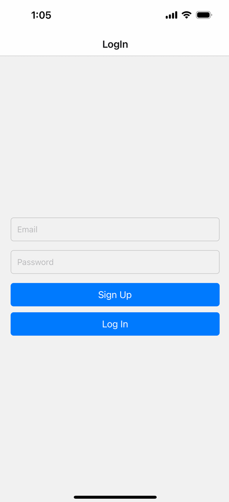
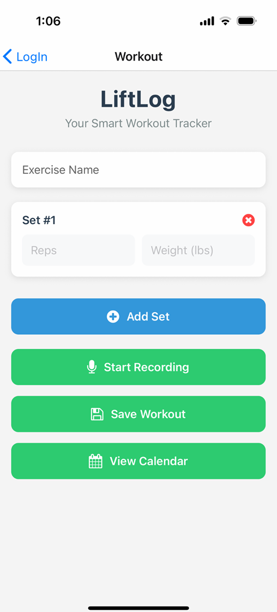
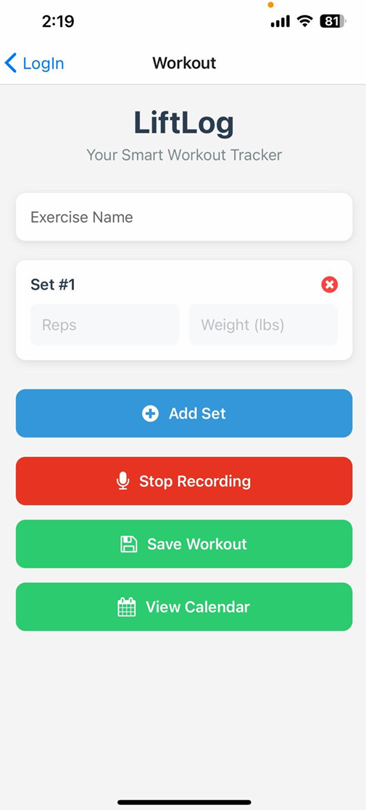
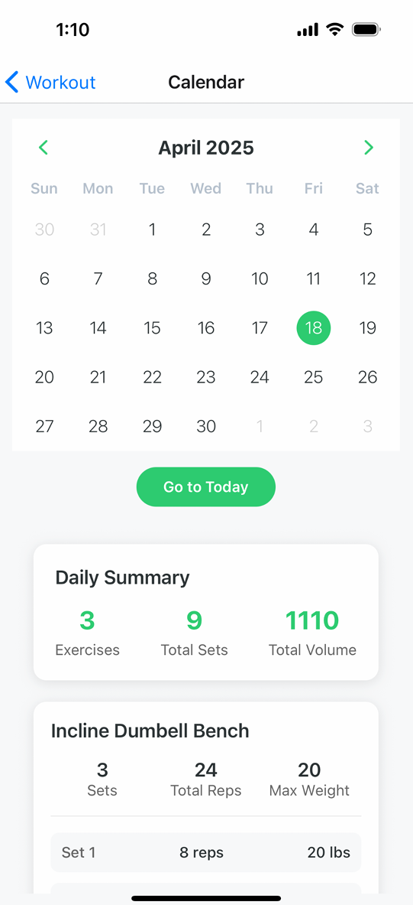
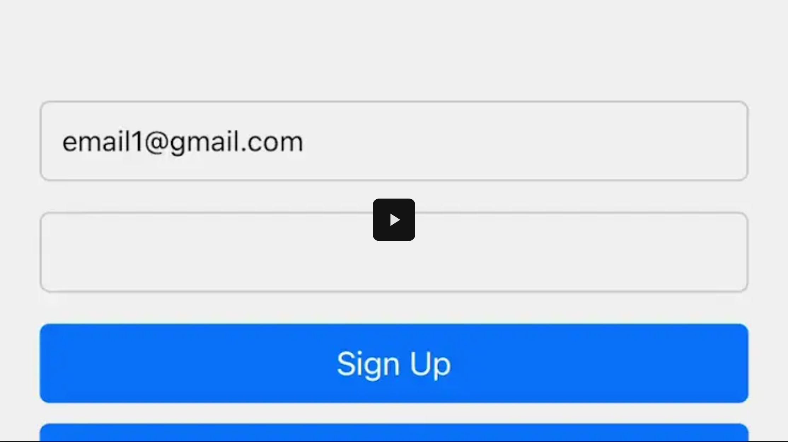

# LiftLog

LiftLog is a cross-platform fitness tracking application that allows users to log, review, and analyze their workouts with ease. The app features voice-to-text workout logging, a calendar for reviewing workout history, and secure authentication. The backend leverages Node.js, Express, Google Cloud Speech-to-Text, and Firebase for robust, scalable performance.

---

## Features

- **Voice-to-Text Logging:** Record workouts by speaking; the app transcribes and parses your input.
- **Manual Workout Entry:** Add and edit exercises, sets, reps, and weights.
- **Calendar Integration:** Visualize workout history with day indicators and detailed cards.
- **Firebase Authentication:** Secure user login and data storage.
- **Google Cloud Speech Integration:** Accurate audio transcription for hands-free logging.
- **Responsive UI:** Modern, mobile-friendly design with intuitive navigation.

---

## Screenshots

### 📱 Login Screen

### 🏠 Home Screen

### 🎙️ Voice Logging

### 🗓️ Calendar View

---

## Video Demo

### Video

---

## Tech Stack

- **Frontend:** React Native (Expo)
- **Backend:** Node.js, Express
- **Database:** Firebase Firestore
- **Authentication:** Firebase Auth
- **Audio Transcription:** Google Cloud Speech-to-Text API
- **Other:** FFmpeg (audio conversion)

---

## Install Dependencies

### Backend

`cd LiftLog-backend`
`npm install`

### Frontend

`npm install`

# Usage

## Start the Backend

`cd LiftLog-backend`
`node server.js`

## Start the Frontend

Download the ExpoGO App on your mobile device
`npx expo start`
Scan the generated QR Code

## Logging a Workout

1. Log in or sign up.
2. Use the microphone or manual entry to log your workout.
3. View your workout history in the calendar.

---

## Environment Variables & Security

- All secrets and keys for services used in this project have been disabled.
